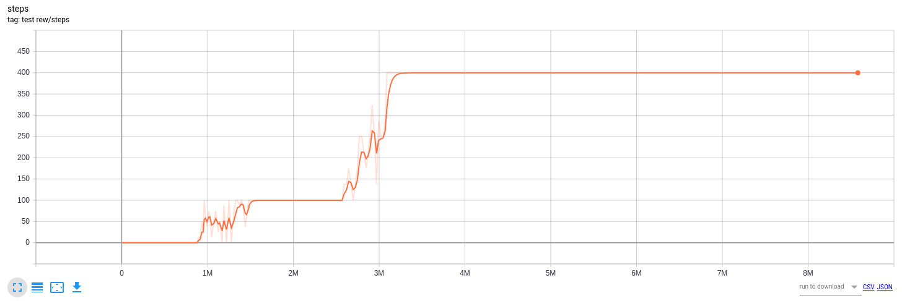
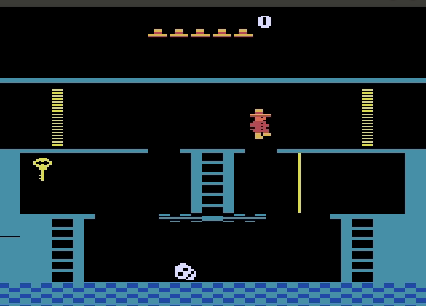

# SDRL-Montezuma
A repository producing the result of SDRL

This repository is based on [MontezumaRevenge_SDRL](https://github.com/daomingAU/MontezumaRevenge_SDRL.git) and thanks DaoMing Liu.

What I did:
* Fix the bug and add code snippet for testing in the training process
* Add the testing code using clingo planner to generate plantrace instead of humanly assigning subgoals

For those who want to visualize the results, the library atari_py needs to be recomplied by setting the parameters 'Use SDL' True

